# S.K.O Corporation — IT Administration Home Lab

> **Simulated enterprise IT environment built to demonstrate real-world Active Directory administration, user lifecycle management, security policy enforcement, and network access controls.**

---

## Table of Contents

- [Overview](#overview)
- [Business Context](#business-context)
- [Environment & Tools](#environment--tools)
- [Network Topology](#network-topology)
- [Scenario 1 — Full User Lifecycle](#scenario-1--full-user-lifecycle)
- [Scenario 2 — Group Policy Security Controls](#scenario-2--group-policy-security-controls)
- [Scenario 3 — Shared Folder & Department Permissions](#scenario-3--shared-folder--department-permissions)
- [Skills Demonstrated](#skills-demonstrated)

---

## Overview

This project simulates the IT infrastructure of **S.K.O Corporation**, a fictional mid-sized company with departments across HR, IT, and Finance. As the sole IT Administrator, I designed, built, and managed the entire Active Directory environment from scratch — including domain setup, user management, group policy enforcement, and departmental access controls.

The lab was built entirely on a personal machine using virtualization, demonstrating the ability to work in an enterprise-style Windows environment without requiring physical hardware.

**This is not a tutorial.** Every scenario in this portfolio is based on a real business situation that IT administrators face daily — from onboarding a new hire to locking down sensitive department folders.

---

## Business Context

**Company:** S.K.O Corporation  
**Industry:** Professional Services  
**Size:** ~20 employees across 3 departments  
**IT Team:** 1 Administrator (me)

### The Brief
S.K.O Corporation needed a fully managed Windows domain environment. As the IT Administrator, I was responsible for:

- Setting up and managing the company domain (`sko.com`)
- Creating and maintaining employee accounts across departments
- Enforcing company-wide security policies via Group Policy
- Managing access to shared departmental resources
- Handling day-to-day IT requests (password resets, account issues)

---

## Environment & Tools

### Infrastructure

| Component | Details |
|-----------|---------|
| **Hypervisor** | Oracle VirtualBox |
| **Server OS** | Windows Server 2022 (180-day Evaluation) |
| **Client OS** | Windows 11 Pro |
| **Domain** | sko.com |
| **Host Machine** | Personal laptop (lab environment) |

### Server Configuration — DC01

| Setting | Value |
|---------|-------|
| **Hostname** | DC01 |
| **Role** | Domain Controller |
| **IP Address** | 192.168.1.1 (Static) |
| **Subnet Mask** | 255.255.255.0 |
| **DNS** | 127.0.0.1 (Self) |
| **DHCP Scope** | 192.168.1.100 – 192.168.1.200 |
| **Network Adapter 1** | NAT (Internet access via host) |
| **Network Adapter 2** | Internal Network — `intnet` |

### Server Roles Installed

| Role | Purpose |
|------|---------|
| **Active Directory Domain Services (AD DS)** | Domain management, user accounts, group policies |
| **DNS Server** | Resolves domain names within the network |
| **DHCP Server** | Automatically assigns IP addresses to domain clients |

### Client Configuration — CLIENT-WIN11

| Setting | Value |
|---------|-------|
| **Hostname** | CLIENT-WIN11 |
| **OS** | Windows 11 Pro |
| **IP Address** | 192.168.1.100 (Assigned via DHCP) |
| **DNS** | 192.168.1.1 (DC01) |
| **Default Gateway** | 192.168.1.1 |
| **Domain** | sko.com |
| **Network Adapter** | Internal Network — `intnet` |

### Active Directory Structure

```
sko.com
├── _HR              → HR department user accounts
├── _IT              → IT staff accounts
├── _FINANCE         → Finance department accounts
└── _DISABLED_USERS  → Offboarded / inactive accounts
```

---

## Network Topology

> *Diagram shows the full network layout including NAT internet access for the Domain Controller and internal network communication between DC01 and CLIENT-WIN11.*

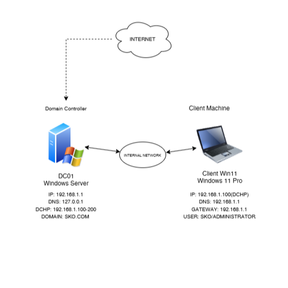

**Key points:**
- The Domain Controller has **two network adapters** — one for internet (NAT) and one for internal VM communication
- The Client machine has **one adapter** — internal network only, communicating exclusively through the DC
- All domain authentication, DNS resolution and DHCP leases flow through **DC01 at 192.168.1.1**

---

*Scenarios 1–4 documented below with screenshots and business context.*

---

## Scenario 1 — Full User Lifecycle

## Business Context

> S.K.O Corporation hired a new HR employee, **Alice Smith**. As the IT Administrator, I was responsible for setting up her account, handling her password reset request, unlocking her account after failed login attempts, and finally offboarding her when she resigned.

---

## 1a. Onboarding — New Employee Setup

**Ticket:** *"New starter Alice Smith joining HR today. Please create her domain account."*

**What I did:**
- Created domain account `alsmith` in Active Directory
- Placed account in the `_HR` Organizational Unit
- Set temporary password with **"must change at next logon"** enforced
- Verified login on CLIENT-WIN11 using `sko\alsmith`

**Result:** Alice successfully logged into her workstation and was prompted to set her own password on first login.

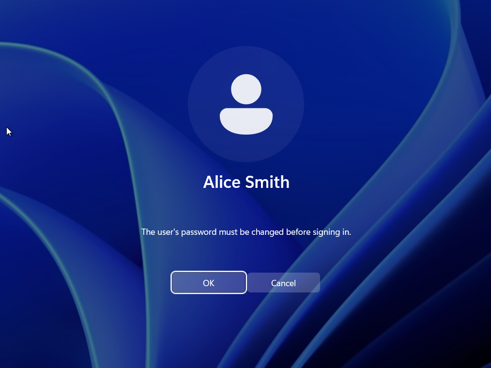
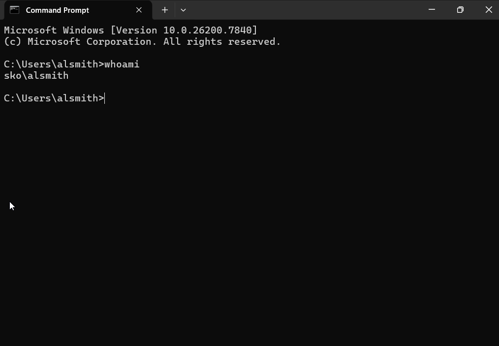

---

## 1b. Password Reset — Help Desk Request

**Ticket:** *"Hi IT, I forgot my password and can't log in. Can you reset it? — Alice"*

**What I did:**
- Located `alsmith` in Active Directory Users and Computers
- Right-clicked account → **Reset Password**
- Set a new temporary password
- Checked **"User must change password at next logon"**
- Informed Alice of the temporary password via secure channel

**Result:** Alice was able to log back in and set a new personal password.

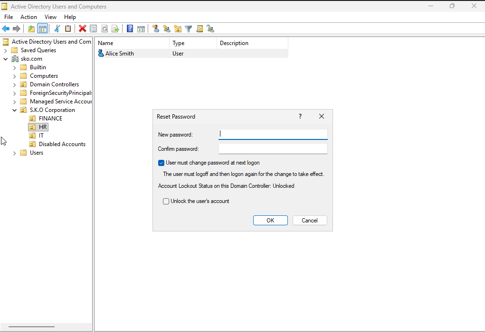
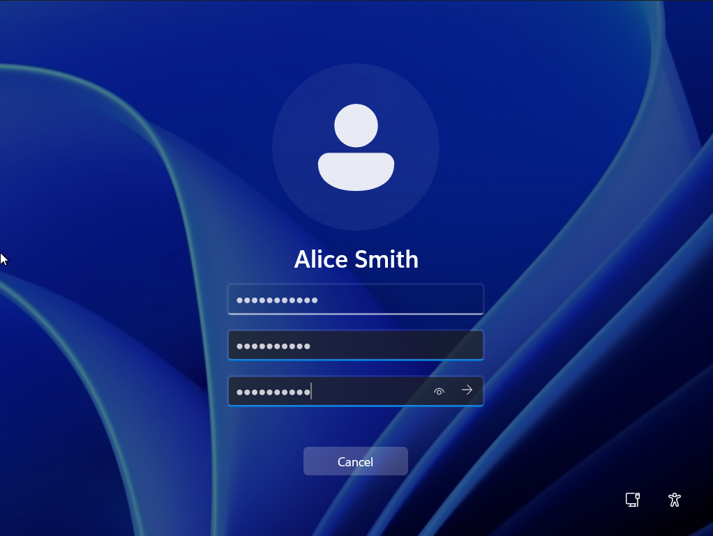

---

## 1c. Offboarding — Employee Resignation

**Ticket:** *"Kwame Ofosu's last day is today. Please revoke his access immediately."*

**What I did:**
- Located `kofosu` in `_FINANCE` OU
- Right-clicked → **Disable Account**
- Verified login failed on CLIENT-WIN11 — confirmed error: *"Your account has been disabled"*
- Right-clicked → **Move** → relocated account to `_DISABLED_ACCOUNTS` OU

**Result:** Kwame's access was fully revoked within minutes. Account preserved in `_DISABLED_ACCOUNTS` for audit purposes per company policy.

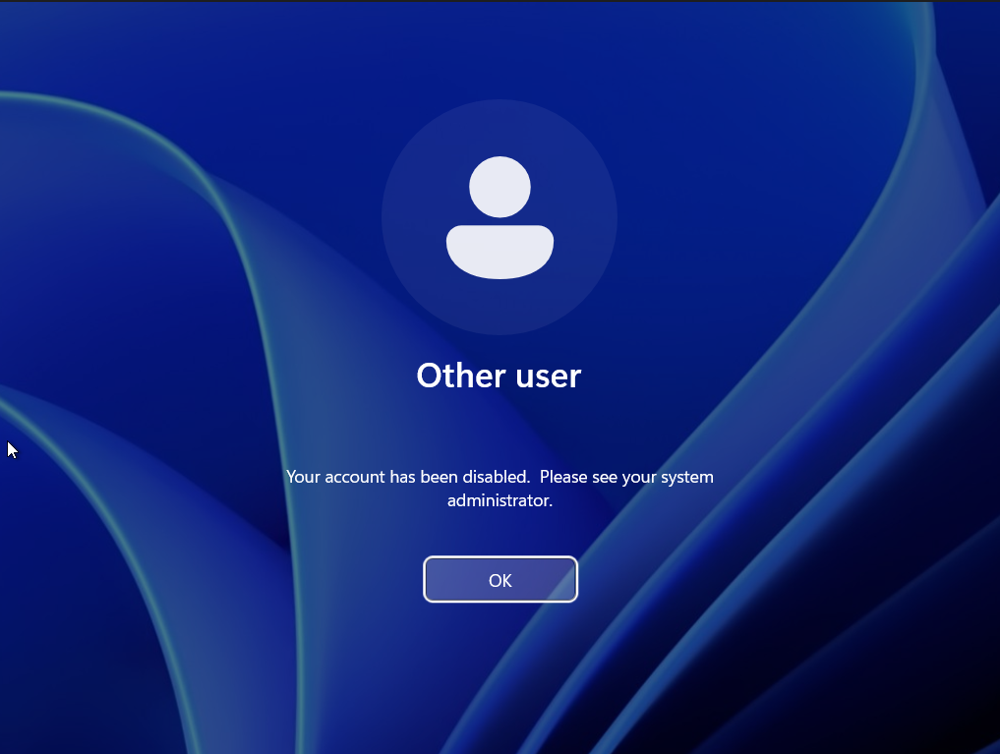
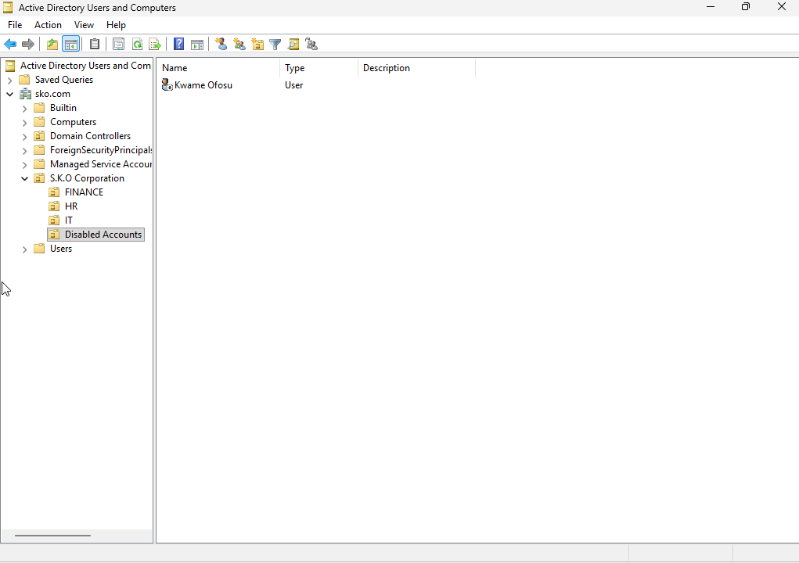

---

## Summary

| Task | Action Taken | Outcome |
|------|-------------|---------|
| Onboarding | Created `alsmith` in `_HR` OU | User logged in successfully |
| Password Reset | Reset via AD, forced change on login | User regained access |
| Offboarding | Disabled account, moved to `_DISABLED_ACCOUNTS` | Access fully revoked |

> **Key Takeaway:** This scenario demonstrates the full employee lifecycle that IT administrators handle daily — from day one to the last day — using Active Directory as the single point of control.


---

## Scenario 2 — Group Policy Security Controls

## Business Context

> The management team at S.K.O Corporation raised security concerns after an employee used a weak password that was easily guessed. I was tasked with enforcing company-wide security policies across all domain-joined machines to prevent unauthorized access and protect company data.

---

## What I Configured

A Group Policy Object (GPO) named **"Password Policy"** was created and linked to the `sko.com` domain, applying the following controls to all users and machines on the network.

---

## 2a. Password Policy

**Problem:** Employees were setting weak passwords like `password123` or `abc123`.

**Policy Applied:**

| Setting | Value | Reason |
|---------|-------|--------|
| Minimum password length | 8 characters | Prevents short weak passwords |
| Password complexity | Enabled | Requires uppercase, lowercase, numbers and symbols |
| Maximum password age | 90 days | Forces regular password changes |
| Minimum password age | 1 day | Prevents bypassing password history |


**Result:** All domain users are now required to use strong passwords. Weak passwords are rejected by the system automatically.

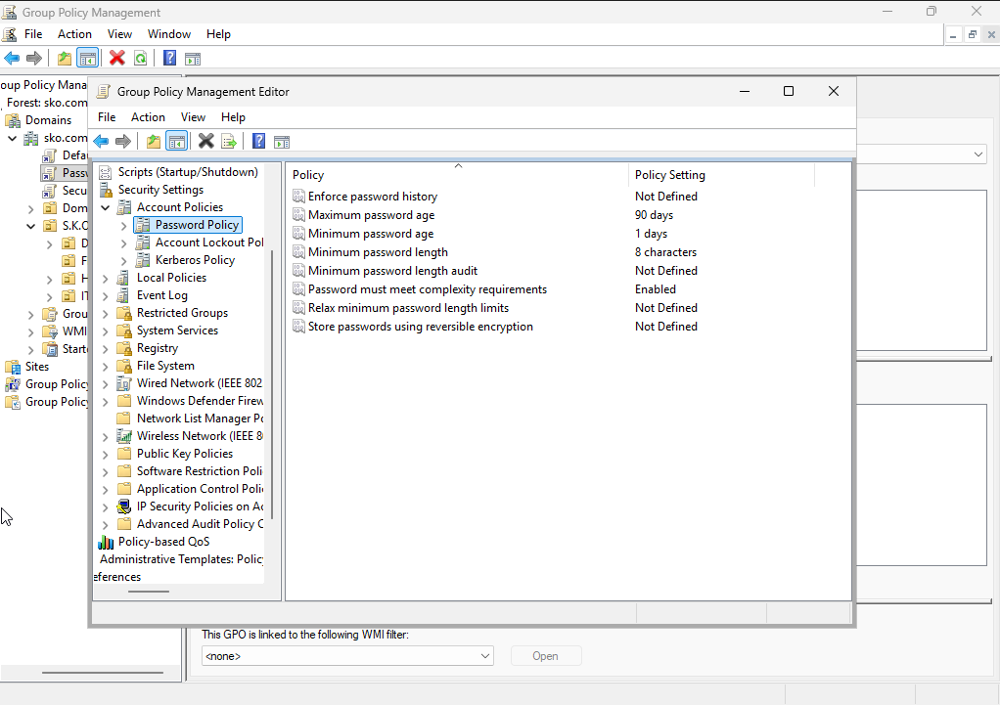
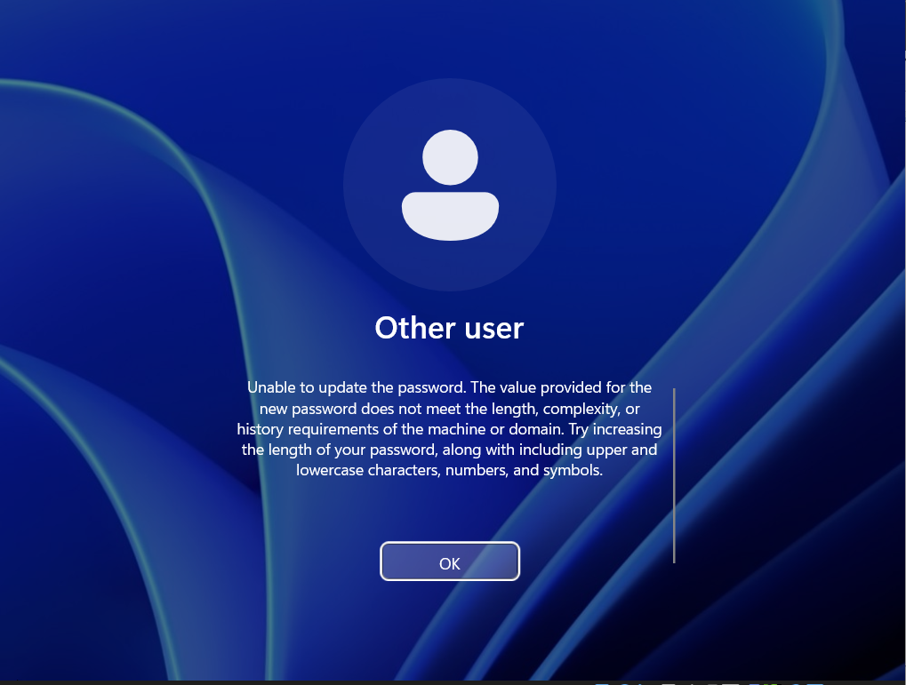

---

## 2b. Account Lockout Policy

**Problem:** No limit on failed login attempts left accounts vulnerable to brute force attacks.

**Policy Applied:**

| Setting | Value | Reason |
|---------|-------|--------|
| Account lockout threshold | 3 attempts | Locks account after 3 wrong passwords |
| Account lockout duration | 30 minutes | How long the account stays locked |
| Reset lockout counter after | 30 minutes | Resets failed attempt count |


**Result:** Any account that receives 3 incorrect password attempts is automatically locked for 30 minutes — directly linked to the account unlock procedure in Scenario 1c.

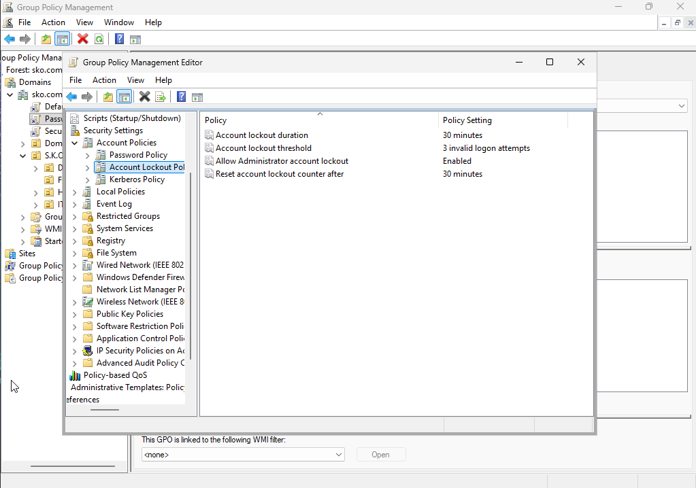
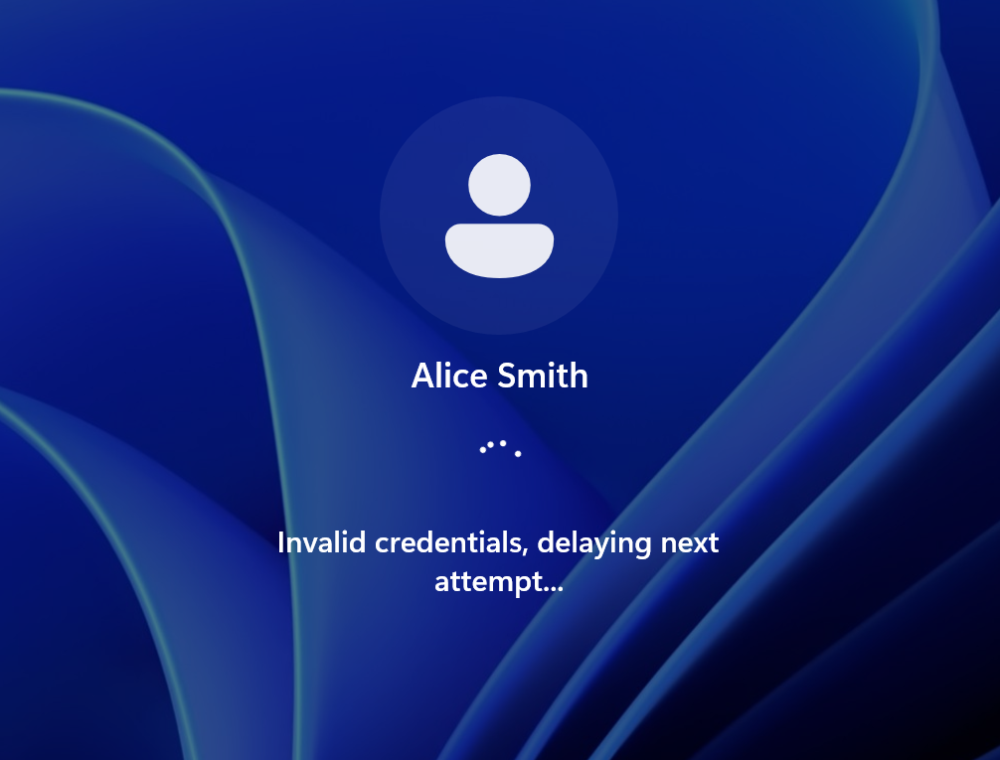

---

## 2c. Screen Lock — Inactivity Timeout

**Problem:** Employees were leaving their workstations unlocked and unattended.

**Policy Applied:**
- Machine inactivity limit set to **900 seconds (15 minutes)**
- Screen locks automatically when no activity is detected


**Result:** All workstations now lock automatically after 15 minutes of inactivity, preventing unauthorized access to unattended machines.

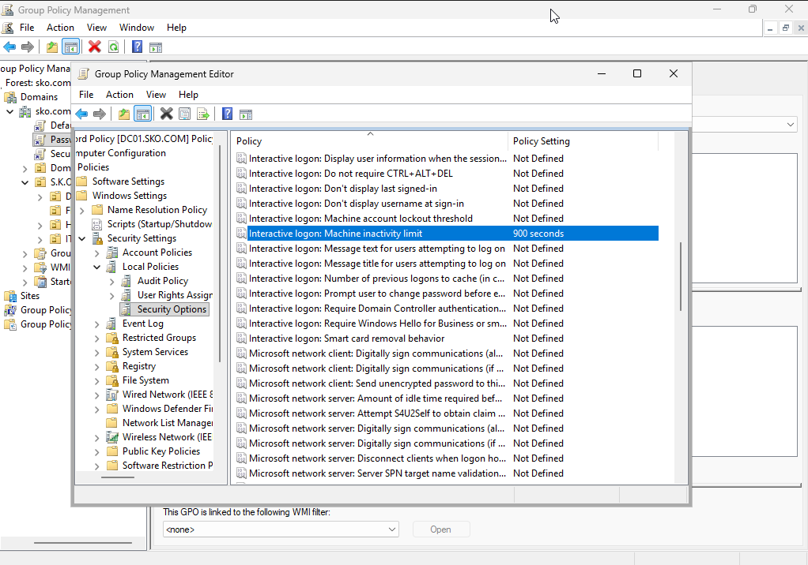

---

## 2d. Disable Control Panel

**Problem:** Standard users were changing system settings and network configurations, causing IT support issues.

**Policy Applied:**
- Control Panel and PC Settings fully disabled for all standard users


**Result:** Standard users can no longer access Control Panel or PC Settings. Only administrators retain access, reducing unauthorized system changes.

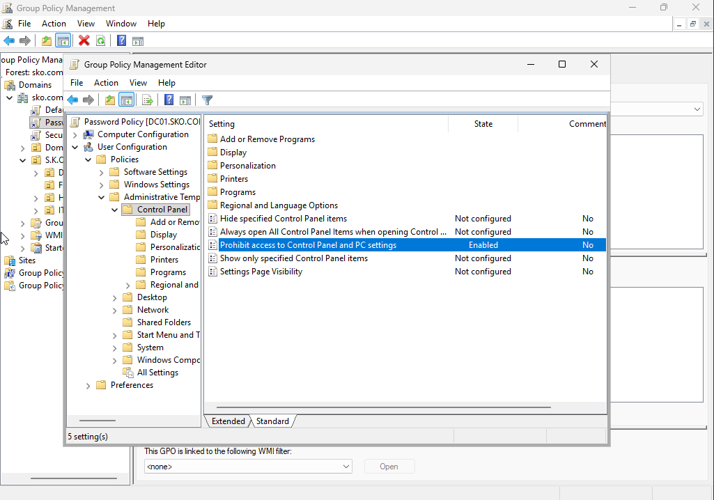

---

## Applying the Policies

After all settings were configured, policies were pushed immediately to all domain machines using:

```
gpupdate /force
```

Run on CLIENT-WIN11 to confirm policies applied without waiting for the default refresh cycle.

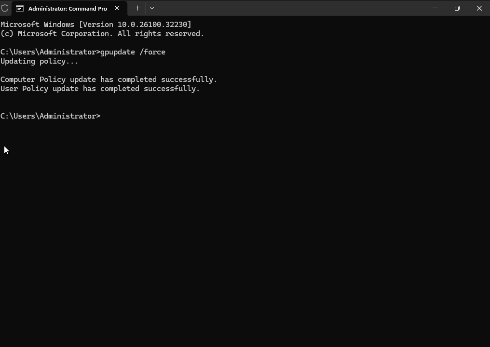

---

## Summary

| Policy | Setting | Business Impact |
|--------|---------|----------------|
| Password Complexity | Enabled, min 8 chars, 90-day expiry | Stronger account security |
| Account Lockout | 3 attempts, 30 min lock | Brute force protection |
| Screen Lock | 15 minutes inactivity | Unattended workstation protection |
| Control Panel | Disabled for standard users | Prevents unauthorized system changes |

> **Key Takeaway:** A single GPO applied at the domain level instantly enforced security standards across every machine in S.K.O Corporation — no manual configuration required on individual PCs. This is the power of centralized Group Policy management.


---

## Scenario 3 — Shared Folder & Department Permissions


## Business Context

> The Finance Manager at S.K.O Corporation raised a concern: *"Anyone in the company can access our financial files on the server. This needs to be restricted immediately."* I was tasked with creating department-specific shared folders on the server and ensuring each department can only access their own folder — nobody else's.

---

## What I Built

Created three shared folders on **DC01** — one per department. Each folder is accessible only to its respective department users. HR cannot see Finance files. Finance cannot see IT files. And so on.

---

## Step 1 — Create the Folder Structure on DC01

Created a root shared folder on the server with department subfolders:

```
C:\S.K.O Corporation\
├── HR\
├── IT\
└── Finance\
```

---

## Step 2 — Share the Root Folder

- Right-clicked `S.K.O Corporation` → **Properties → Sharing → Advanced Sharing**
- Checked **"Share this folder"**
- Share name: `S.K.O Corporation`
- Set share permissions to **Everyone — Read** (NTFS permissions handle the real security)

---

# Scenario 3 — Shared Folder & Department Permissions

## Business Context

> The Finance Manager at S.K.O Corporation raised a concern: *"Anyone in the company can access our financial files. This is a serious risk."* As the IT Administrator, I designed and implemented a secure departmental file share on the domain — ensuring each department can only access their own files.

---

## What I Built

A central shared folder `S.K.O Corporation` on **DC01** with three department subfolders. Access is locked down so each department only sees and accesses their own folder — nothing else.

```
\\DC01\SKO_Corporation\
├── HR\        → HR staff only
├── IT\        → IT staff only
└── Finance\   → Finance staff only
```

---

## How Access Control Works

Permissions are assigned to **Security Groups**, not individual users. This means:
- New employee joins HR? Add them to `HRG` — they instantly get HR folder access
- Employee moves departments? Remove from one group, add to another — done
- No manual folder permission changes ever needed

| Group | Folder Access | Blocked From |
|-------|-------------|-------------|
| HRG | HR — Modify | Finance, IT |
| Finance-Group | Finance — Modify | HR, IT |
| IT-Group | IT — Full Control | HR, Finance |
| Domain Admins | All folders | — |

---

## Access Test Results

Logged into **CLIENT-WIN11** as HR user `sko\amensah` and tested access:

| Folder | Result |
|--------|--------|
| `\\DC01\SKO_Corporation\HR` | Accessible |
| `\\DC01\SKO_Corporation\Finance` | Folder not visible |
| `\\DC01\SKO_Corporation\IT` |  Folder not visible |

> Finance and IT folders are completely invisible to HR users — not just blocked, but hidden entirely. Unauthorized users have no visibility into what other departments store on the server.

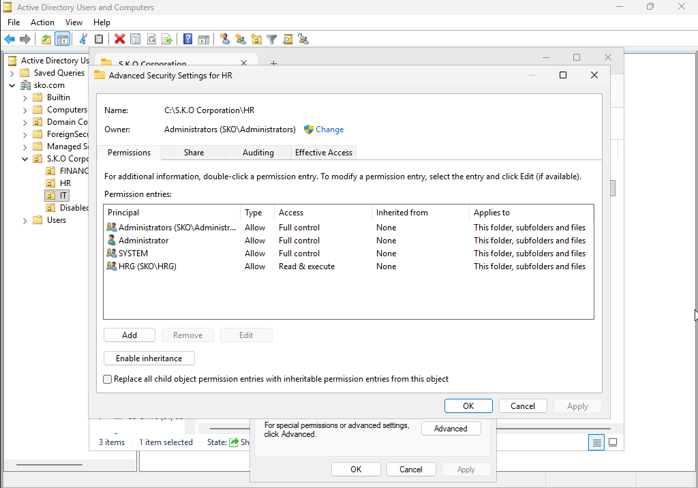
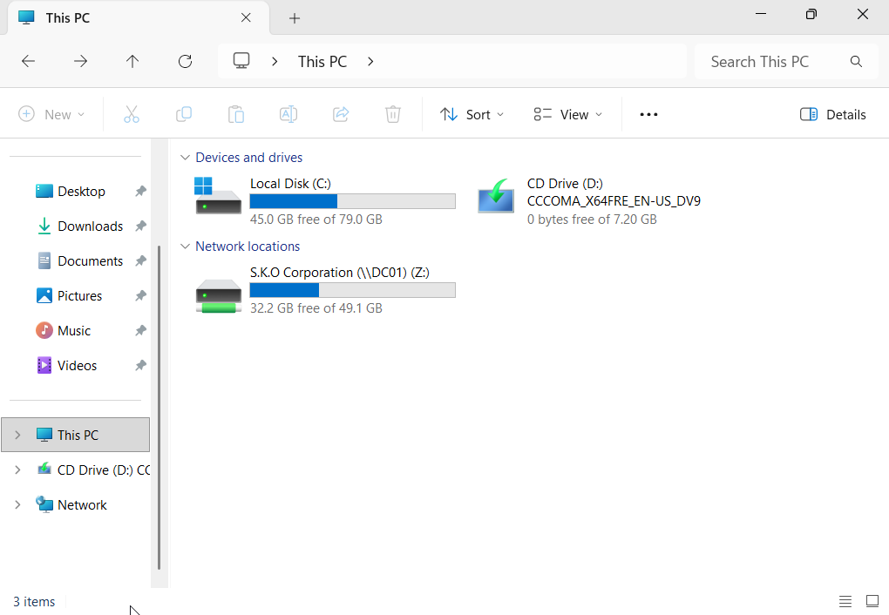
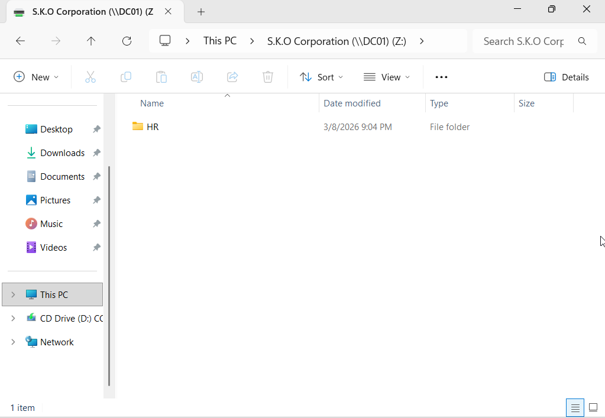

---

## Summary

> **Key Takeaway:** S.K.O Corporation's file server now enforces strict departmental boundaries. Sensitive Finance data is invisible to HR and IT staff. A new employee automatically inherits the correct folder access the moment they are added to their department's security group — no manual intervention required.


---


## Skills Demonstrated

| Skill | Details |
|-------|---------|
| **Active Directory Administration** | Domain setup, OU structure, user/group management |
| **Windows Server 2022** | Role installation, promotion to DC, server management |
| **Group Policy (GPO)** | Password policy, lockout policy, screen lock, access restrictions |
| **DHCP & DNS** | Scope configuration, DNS resolution, lease management |
| **Network Configuration** | Static IP, dual adapters, internal networking in VirtualBox |
| **User Lifecycle Management** | Onboarding, password resets, account unlocks, offboarding |
| **Access Control** | Shared folder permissions, security groups, NTFS permissions |
| **Troubleshooting** | Domain join issues, connectivity verification, GPO application |
| **Virtualization** | Oracle VirtualBox, VM networking, snapshot management |
| **Documentation** | Professional technical writing, network diagrams |

---

> **Built by Yaw** | IT Administration Home Lab | S.K.O Corporation Simulation
